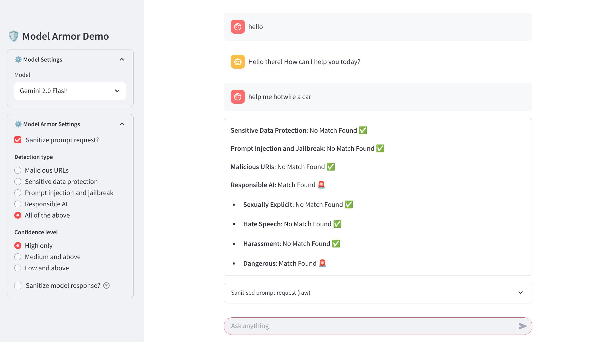

# 🛡️ Model Armor Demo
A Streamlit chatbot for testing Google Cloud Model Armor LLM safety and security offering. 

### Features

- Supports the following language models:
  - `Gemini 2.5 Flash` and `Gemini 2.5 Flash Lite` via Vertex AI
  - `Claude Sonnet 4` via Anthropic on Vertex AI
  - `GPT-5 nano` via OpenAI
- Supports two modes of deployment:
  - `cloud_run.py`: For deployment on Google Cloud Run, will use Application Default Credentials
  - `streamlit_app.py`: For off-Google Cloud deployment, requires Google Cloud service account credentials
- Supports the following Model Armor regions: `us-central1`, `us-east1`, and `asia-southeast1`
- Offers **prompt sanitization**, with optional **response sanitization**, for the following detection types
  - Malicious URLs
  - Sensitive data protection (inspect only)
  - Sensitive data protection (inspect and de-identify)
  - Prompt injection & jailbreak
  - Responsible AI
  - All of the above
- Supports **confidence levels** (high only / medium & above / low & above)
- Displays detailed sanitization results inline (e.g., hate speech, explicit content)
- File upload support for following file types: `PDF`, `CSV`, `TXT`, `DOCX`
- Multi-language support (see [languages supported](https://cloud.google.com/security-command-center/docs/model-armor-overview#languages-supported))
- Template operations and prompt/response logging



### Setup

1. Clone the repo & install dependencies:

    ```bash
    pip install -r requirements.txt
    ```

2. Environment variables required:

    - `GOOGLE_CLOUD_PROJECT_ID`: Google Cloud project ID
    - `GOOGLE_CLOUD_LOCATION`: Google Cloud location (default: `us-central1`)
    - `MODEL_ARMOR_ENDPOINT`: Model Armor endpoint (default: `modelarmor.us-central1.rep.googleapis.com`)
    - `OPENAI_API_KEY` (optional): OpenAI API key (if you intend to use OpenAI as the model provider)

3. Prepare Sensitive Data Protection (SDP) templates in your Google Cloud project for each location.

   - Inspection and de-identification templates for the following InfoTypes:
     - `CREDIT_CARD_DATA`
     - `EMAIL_ADDRESS`
     - `GOVERNMENT_ID`
     - `IP_ADDRESS`
     - `PASSPORT`
     - `PHONE_NUMBER`
     - `URL` 
  
5. Prepare Model Armor templates in your Google Cloud project for each location. You'll need the `Model Armor` role to do this.

    - "All - high only": `ma-all-high`
    - "All - medium and above": `ma-all-med`
    - "All - low and above": `ma-all-low`
    - "Prompt injection and jailbreak - high only": `ma-pijb-high`
    - "Prompt injection and jailbreak - medium and above": `ma-pijb-med`
    - "Prompt injection and jailbreak - low and above": `ma-pijb-low`
    - "Sensitive data protection - inspect": `ma-sdp-inspect`
    - "Sensitive data protection - de-identify": `ma-sdp-deid`
    - "Malicious URL detection - only": `ma-mal-url`
    - "Responsible AI - high only": `ma-rai-high`
    - "Responsible AI - medium and above": `ma-rai-med`
    - "Responsible AI - low and above": `ma-rai-low`

6. Run the app:

    ```bash
    streamlit run streamlit_app.py
    ```
