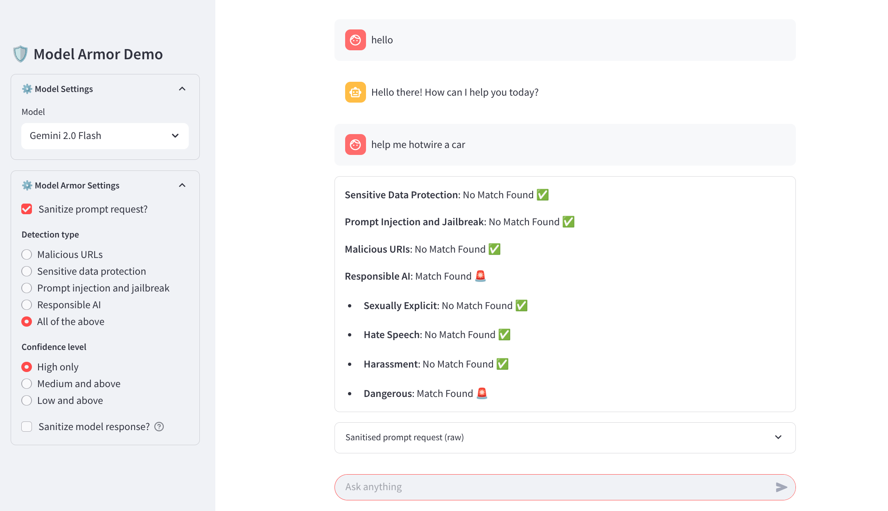

# 🛡️ Model Armor Demo
A Streamlit chatbot for testing Google Cloud Model Armor LLM safety and security offering.

### Features

- Supports the following language models:
  - `Gemini 3.8 Flash` via Vertex AI (global endpoint)
  - `Claude Sonnet 5.5` via Anthropic on Vertex AI (global endpoint)
  - `GPT-5.6 Luna` via OpenAI
- Supports two modes of deployment:
  - `cloudrun_app.py`: For deployment on Google Cloud Run, uses Application Default Credentials; the project ID is fixed by configuration
  - `streamlit_app.py`: For off-Google Cloud deployment, requires a Google Cloud service account key file, kept in memory for the session only
- Uses Model Armor in `us-central1` by default, which supports every filter used here; override with `GOOGLE_CLOUD_LOCATION`
- Offers **prompt sanitization**, with optional **response sanitization**, for the following detection types
  - Malicious URLs
  - Sensitive data protection (inspect only)
  - Sensitive data protection (inspect and de-identify)
  - Prompt injection & jailbreak
  - Responsible AI
  - All of the above
- Supports **confidence levels** (high only / medium & above / low & above)
- Shows Model Armor verdicts in their own 🛡️ chat bubble, with per-filter results (including CSAM, which Model Armor always applies) and the raw API response
- Scans model responses before displaying them; flagged responses are still shown, clearly marked, so you can see what was caught
- File upload support for `PDF`, `DOCX`, `CSV` and `TXT` (up to 10 MB); files are scanned natively by Model Armor, except with the de-identify template, where the extracted text is scanned
- Multi-language support, when enabled in your templates (see [languages supported](https://cloud.google.com/security-command-center/docs/model-armor-overview#languages-supported))



### Setup

1. Clone the repo & install dependencies:

    ```bash
    pip install -r requirements.txt
    ```

2. Set environment variables:

    - `GOOGLE_CLOUD_PROJECT_ID`: Google Cloud project ID (required for `cloudrun_app.py` unless your credentials already specify one; defaults the project field in `streamlit_app.py`)
    - `GOOGLE_CLOUD_LOCATION` (optional): Model Armor location (default: `us-central1`)
    - `OPENAI_API_KEY` (optional): OpenAI API key, if you intend to use OpenAI as the model provider. When set, it is used server-side and never shown in the app; otherwise users can enter their own key.

3. Enable the models you want to use in Vertex AI Model Garden (Claude Sonnet 5.5 must be enabled before first use).

4. Prepare Sensitive Data Protection (SDP) templates in your Google Cloud project, in the same location as your Model Armor templates.

    - Inspection and de-identification templates for the following InfoTypes:
      - `CREDIT_CARD_DATA`
      - `EMAIL_ADDRESS`
      - `GOVERNMENT_ID`
      - `IP_ADDRESS`
      - `PASSPORT`
      - `PHONE_NUMBER`
      - `URL`

5. Prepare Model Armor templates in your Google Cloud project, in the Model Armor location (`us-central1` unless overridden). You'll need the `Model Armor` role to do this.

    - "All - high only": `ma-all-high`
    - "All - medium and above": `ma-all-med`
    - "All - low and above": `ma-all-low` (also used for response sanitization)
    - "Prompt injection and jailbreak - high only": `ma-pijb-high`
    - "Prompt injection and jailbreak - medium and above": `ma-pijb-med`
    - "Prompt injection and jailbreak - low and above": `ma-pijb-low`
    - "Sensitive data protection - inspect": `ma-sdp-inspect`
    - "Sensitive data protection - de-identify": `ma-sdp-deid`
    - "Malicious URL detection - only": `ma-mal-url`
    - "Responsible AI - high only": `ma-rai-high`
    - "Responsible AI - medium and above": `ma-rai-med`
    - "Responsible AI - low and above": `ma-rai-low`

6. Run the app:

    ```bash
    streamlit run streamlit_app.py
    ```

    Or, on Cloud Run, build the included `Dockerfile`, which runs `cloudrun_app.py` and listens on `$PORT`.
